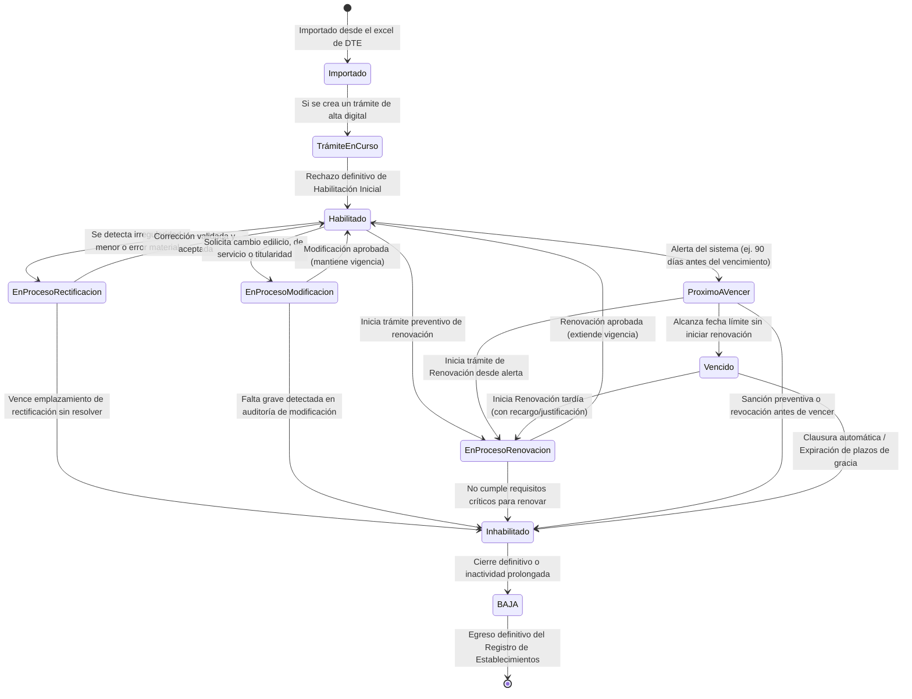

## DTE ESTABLECIMIENTO - ORIGEN IMPORTADO

```mermaid
stateDiagram-v2
[*] --> Importado : Importado desde el excel de DTE

    Importado --> TrámiteEnCurso : Si se crea un trámite de alta digital
    TrámiteEnCurso --> Habilitado : Rechazo definitivo de Habilitación Inicial

    Habilitado --> EnProcesoRectificacion : Se detecta irregularidad menor o error material
    EnProcesoRectificacion --> Habilitado : Corrección validada y aceptada
    EnProcesoRectificacion --> Inhabilitado : Vence emplazamiento de rectificación sin resolver

    Habilitado --> EnProcesoModificacion : Solicita cambio edilicio, de servicio o titularidad
    EnProcesoModificacion --> Habilitado : Modificación aprobada (mantiene vigencia)
    EnProcesoModificacion --> Inhabilitado : Falta grave detectada en auditoría de modificación

    Habilitado --> EnProcesoRenovacion : Inicia trámite preventivo de renovación
    EnProcesoRenovacion --> Habilitado : Renovación aprobada (extiende vigencia)
    EnProcesoRenovacion --> Inhabilitado : No cumple requisitos críticos para renovar

    Habilitado --> ProximoAVencer : Alerta del sistema (ej. 90 días antes del vencimiento)

    ProximoAVencer --> EnProcesoRenovacion : Inicia trámite de Renovación desde alerta
    ProximoAVencer --> Vencido : Alcanza fecha límite sin iniciar renovación
    ProximoAVencer --> Inhabilitado : Sanción preventiva o revocación antes de vencer

    Vencido --> EnProcesoRenovacion : Inicia Renovación tardía (con recargo/justificación)
    Vencido --> Inhabilitado : Clausura automática / Expiración de plazos de gracia

    Inhabilitado --> BAJA : Cierre definitivo o inactividad prolongada
    BAJA --> [*] : Egreso definitivo del Registro de Establecimientos
```
